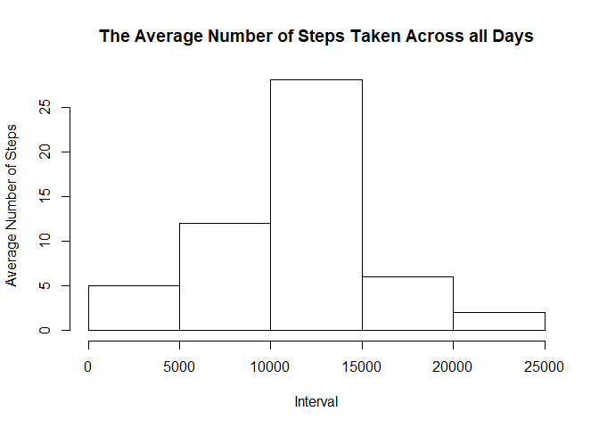

## Loading and preprocessing the data


```r
data <- read.csv("E:/Nada/Others/Courses/Data Science Specialization/Ex/Course 5/activity.csv")
processedData <- subset(data, !is.na(data$steps))
```

## What is mean total number of steps taken per day?


```r
sums <- aggregate(as.numeric(processedData$steps), by=list(date=processedData$date), FUN=sum)
hist(sums$x, main = "The Average Number of Steps Taken Across all Days", xlab="Interval", ylab="Average Number of Steps")
```

<!-- -->

Mean and Median of the total number of Steps per Day
Mean:

```r
mean_steps <- mean(sums$x, na.rm=TRUE)
mean_steps
```

```
## [1] 10766.19
```

Median:

```r
median_steps <- median(sums$x, na.rm=TRUE)
median_steps
```

```
## [1] 10765
```

## What is the average daily activity pattern?


```r
avg <- aggregate(as.numeric(processedData$steps), by=list(interval=processedData$interval), FUN=mean)
plot(avg$interval, avg$x, type="l", main = "The Average Number of Steps Taken Across all Days", xlab="Interval", ylab="Average Number of Steps")
```

<!-- -->

The maximum average is 

```r
max(avg$x)
```

```
## [1] 206.1698
```

## Imputing missing values

The number of missing values is 


```r
sum(which(is.na(data)))
```

```
## [1] 21483648
```

Replacing the missing values by average of the time interval


```r
navalues <- subset(data, is.na(data))
index <- which(is.na(data))
navalues$steps[avg$interval == navalues$interval] <- avg$x
finalData <- data
finalData$steps[index] <- navalues$steps

sums <- aggregate(as.numeric(finalData$steps), by=list(date=finalData$date), FUN=sum)
hist(sums$x, main = "The Average Number of Steps Taken Across all Days", xlab="Interval", ylab="Average Number of Steps")
```

<!-- -->

## Are there differences in activity patterns between weekdays and weekends?


```r
library(lubridate)
```

```
## Warning: package 'lubridate' was built under R version 3.6.2
```

```
## 
## Attaching package: 'lubridate'
```

```
## The following object is masked from 'package:base':
## 
##     date
```

```r
week <- weekdays(as.Date(finalData$date))
finalData$weekday <- week
```

The maximum average is 

```r
max(avg$x)
```

```
## [1] 206.1698
```
